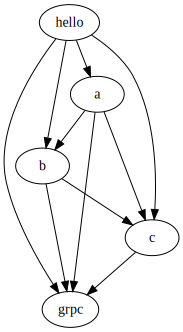

Sample dependency tree in nix for go:

* hello -> a, b, c, grpc
* a -> b, c, grpc
* b -> c, grpc
* c -> grpc



this results in an absurd of instantiations (full log in [out.txt](./out.txt)):

```console
$ grep "instantiated '" out.txt | cut -d " " -f2- | sort | uniq -c | sort -nr
    640 'source' -> '/nix/store/vl5z3q450r7w3wy54b7hs5snmyimzl7f-source.drv'
    640 'google.golang.org_protobuf-structure.json' -> '/nix/store/g3il4ql5p9kp2l4lb1md3yf6if85kslq-google.golang.org_protobuf-structure.json.drv'
    328 'golib-google.golang.org_protobuf_internal_errors' -> '/nix/store/0b7sk13md0s4bscgwa7abi76kdrxmik9-golib-google.golang.org_protobuf_internal_errors.drv'
    328 'golib-google.golang.org_protobuf_internal_detrand' -> '/nix/store/xrmwk3phfifacs5vminqdj22ma6z4gyi-golib-google.golang.org_protobuf_internal_detrand.drv'
    328 'golib-google.golang.org_protobuf_encoding_protowire' -> '/nix/store/7fnb58xymgdkj970dn0s277zfzf6nzin-golib-google.golang.org_protobuf_encoding_protowire.drv'
    304 'golib-google.golang.org_protobuf_reflect_protoreflect' -> '/nix/store/m0irwh2knw1vqqwjxs8cf16hkznknv4f-golib-google.golang.org_protobuf_reflect_protoreflect.drv'
    304 'golib-google.golang.org_protobuf_internal_pragma' -> '/nix/store/xwgkp9g37ybshccw380vw7w6x842l7gx-golib-google.golang.org_protobuf_internal_pragma.drv'
    232 'golib-google.golang.org_protobuf_runtime_protoiface' -> '/nix/store/s4mzyj8r05mlpz6rn5763bzlvcydm9pq-golib-google.golang.org_protobuf_runtime_protoiface.drv'
    232 'golib-google.golang.org_protobuf_reflect_protoregistry' -> '/nix/store/p5y3dxblc8v4nflkhjir03jb84y7iqwy-golib-google.golang.org_protobuf_reflect_protoregistry.drv'
    232 'golib-google.golang.org_protobuf_internal_flags' -> '/nix/store/skz9ccx4xlk1gw81ah8qbkbv8wzzqgzb-golib-google.golang.org_protobuf_internal_flags.drv'
    232 'golib-google.golang.org_protobuf_internal_encoding_messageset' -> '/nix/store/kri6bqbjb7rn7cl8bb1y66qaqsf4w2gr-golib-google.golang.org_protobuf_internal_encoding_messageset.drv'
    208 'golib-google.golang.org_protobuf_proto' -> '/nix/store/6zqc7jsh5q7avfgw5sgf73galjdwfcsv-golib-google.golang.org_protobuf_proto.drv'
    208 'golib-google.golang.org_protobuf_internal_strs' -> '/nix/store/g2aa4pwyfaw5vv1y3m8hxcy65jippbp4-golib-google.golang.org_protobuf_internal_strs.drv'
    208 'golib-google.golang.org_protobuf_internal_order' -> '/nix/store/pkjn578kmc9f19i552bh5hfqsyc5zrma-golib-google.golang.org_protobuf_internal_order.drv'
    208 'golib-google.golang.org_protobuf_internal_genid' -> '/nix/store/sf0fyks4p3j5lgccff876kkm05d2cb3y-golib-google.golang.org_protobuf_internal_genid.drv'
    168 'golib-google.golang.org_protobuf_internal_set' -> '/nix/store/v34sxqpkki7d7xba1y28xvy79b16vdvk-golib-google.golang.org_protobuf_internal_set.drv'
    168 'golib-google.golang.org_protobuf_internal_encoding_text' -> '/nix/store/j3azd5br0d9rbmqvqc753v7fcvrv454b-golib-google.golang.org_protobuf_internal_encoding_text.drv'
    160 'golib-google.golang.org_protobuf_encoding_prototext' -> '/nix/store/2sl1137kk34hvhzshlrdg9l5znv7aad7-golib-google.golang.org_protobuf_encoding_prototext.drv'
    144 'golib-google.golang.org_protobuf_internal_filedesc' -> '/nix/store/hzpmdcyn15pn52rmandhpvjbmg0lhac9-golib-google.golang.org_protobuf_internal_filedesc.drv'
    144 'golib-google.golang.org_protobuf_internal_encoding_defval' -> '/nix/store/f7fm014cs39z474caz6pyl1dvbd0x9ms-golib-google.golang.org_protobuf_internal_encoding_defval.drv'
    144 'golib-google.golang.org_protobuf_internal_editiondefaults' -> '/nix/store/452qdm9lr6qk86kbkgc9rm97rrl9w7yp-golib-google.golang.org_protobuf_internal_editiondefaults.drv'
    144 'golib-google.golang.org_protobuf_internal_descopts' -> '/nix/store/1dma1jraf2c71g5fddwf0a9dszgb4390-golib-google.golang.org_protobuf_internal_descopts.drv'
    144 'golib-google.golang.org_protobuf_internal_descfmt' -> '/nix/store/9azqgmwcmn0r6qidvd6410vf34w9yx04-golib-google.golang.org_protobuf_internal_descfmt.drv'
    136 'golib-google.golang.org_protobuf_runtime_protoimpl' -> '/nix/store/rzhwrs2vz24lq2iwnllj3h258nbccpdq-golib-google.golang.org_protobuf_runtime_protoimpl.drv'
    136 'golib-google.golang.org_protobuf_internal_version' -> '/nix/store/wk01g65b8f418saaxa5m0328r38xl5nx-golib-google.golang.org_protobuf_internal_version.drv'
    136 'golib-google.golang.org_protobuf_internal_impl' -> '/nix/store/q4b47lm54z1i6vp8fjw81anh5szpanka-golib-google.golang.org_protobuf_internal_impl.drv'
    136 'golib-google.golang.org_protobuf_internal_filetype' -> '/nix/store/nk80yvbl1rqwp7yyh9fkzp3j62zgmgnm-golib-google.golang.org_protobuf_internal_filetype.drv'
    136 'golib-google.golang.org_protobuf_internal_encoding_tag' -> '/nix/store/6wqcnvpd3vx7jsszlbv84cp1azvc5ca0-golib-google.golang.org_protobuf_internal_encoding_tag.drv'
     72 'source' -> '/nix/store/2m3760xx68ckn1qwlq9ixi9xwjfyc7vf-source.drv'
     72 'golang.org_x_net-structure.json' -> '/nix/store/ngsxv73877s67bxj57dmh1ay3zg0pbpg-golang.org_x_net-structure.json.drv'
     56 'source' -> '/nix/store/hr0662aljprgvsfzm9jzvjc4nxkm1lr7-source.drv'
     56 'golang.org_x_text-structure.json' -> '/nix/store/b6qdj8n1wmrf2g7gc7kxjxr507b7l93h-golang.org_x_text-structure.json.drv'
     32 'source' -> '/nix/store/1d7yp128i9s38mjqymxh8iy7xd8zv5cv-source.drv'
     32 'golib-google.golang.org_protobuf_types_known_anypb' -> '/nix/store/7g5krykarz4yz25vw1r31lkba4yh8bf5-golib-google.golang.org_protobuf_types_known_anypb.drv'
     32 'golang.org_x_sys-structure.json' -> '/nix/store/mchgjf3wibiznjcldjkj92dw04zm7yd3-golang.org_x_sys-structure.json.drv'
     24 'source' -> '/nix/store/yk3krcyica1dznxxbzi31597r54lc71c-source.drv'
     24 'source' -> '/nix/store/wn24iq71krxc7g8d936vgzs7f143ccnc-source.drv'
     24 'source' -> '/nix/store/js6zj12z6in98csib5sy5i1rizmizlx8-source.drv'
...
```

as you might imagine, in a larger repo with more packages that reference grpc this explodes to thousands of instantiations to protobuf
